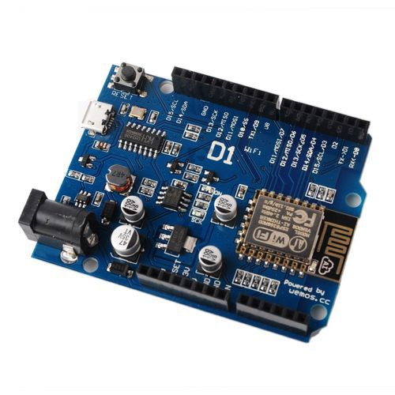

[TOC]

# Arduino core cho ESP8266 WiFi chip

Đây là một dự án mã nguồn mở giúp hỗ trợ môi trường phát triển Arduino cho ESP8266. Giúp bạn có thể viết 1 Sketches sử dụng các thư viện và hàm tương tự của Arduino, có thể chạy trực tiếp trên ESP8266 mà không cần bất kỳ Vi điều khiển nào khác.

ESP8266 Arduino core đi kèm với thư viện kết nối WiFi hỗ trợ TCP, UDP và các ứng dụng HTTP, mDNS, SSDP, DNS Servers. Ngoài ra còn có thể thực hiện cập nhật OTA, sử dụng Filesystem dùng bộ nhớ Flash hay thẻ SD, điều khiển servos, ngoại vi SPI, I2C.

## Đường dẫn: 

- [http://www.arduino.cc/en/main/software](http://www.arduino.cc/en/main/software)
- [http://arduino.esp8266.com/](http://arduino.esp8266.com/)
- [http://esp8266.github.io/Arduino/versions/2.3.0/](http://esp8266.github.io/Arduino/versions/2.3.0/)
- [http://esp8266.github.io/Arduino/versions/2.3.0-rc2/](http://esp8266.github.io/Arduino/versions/2.3.0-rc2/)
