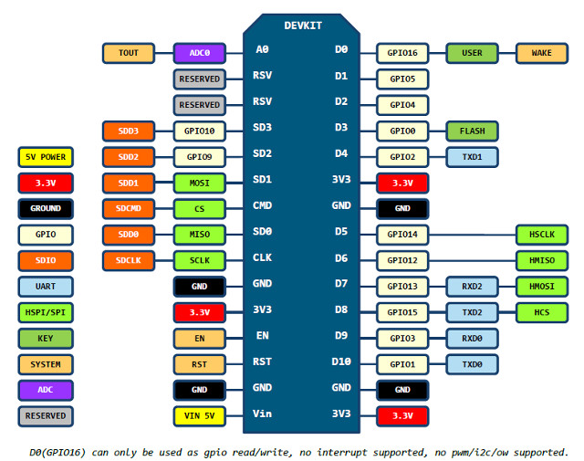

# I2C (Wire library)

Thư viện `Wire` hiện tại chỉ hổ trợ chế độ master lên đến 450KHz. Trước khi sử dụng I2C, chân SDA và SCL cần phải đước thiết lập bằng cách gọi `Wire.begin(int sda, int scl)`, i.e. `Wire.begin(0, 2)` đối với module ESP-01, các module ESP khác mặc định chân 4 (SDA) và 5 (SCL).
#### Dưới đây là một số ví dụ dùng thư viện i2c để hiển thị lên GLCD (LCD OLED SSD1306)
### Cài đặt thư viện lên Arduino IDE

- #### Thư viện `Wire.h`.
 Thư viện này sẽ có sẵn trong Arduino IDE. Khi sử dụng chỉ cần include nó ra là được. Một số hàm cơ bản của nó của nó:


		Wire.begin(address (optional));
Khởi tạo thư viện Wire.h và tham gia vào I2C bus. address: 7-bit địa chỉ của thiết bị "Slave" (optional); nếu không có địa chỉ thì coi như "Master".

		Wire.beginTransmission(address);

Bắt đầu truyền dữ liệu đến thiết bị "Slave" với address đã có.

		Wire.endTransmission();

Kết thúc truyền dữ liệu đến thiết bị "Slave" đã được bắt đầu bởi Wire.beginTransmission(address). 

		Wire.write(value);

Ghi dữ liệu lên thiết bị "Slave", được gọi giữa beginTransmission() và endTransmission().

		Wire.read();

Đọc dữ liệu được truyền từ thiết bị "Slave" đến Arduino, được gọi sau requestFrom().

		Wire.requestFrom(address, quantity);

Được sử dụng bởi thiết bị "Master" để yêu cầu dữ liệu từ thiết bị "Slave". 
{address}: là địa chỉ của thiết bị "Slave". (quantity): số lượng bytes yêu cầu.

- #### Thư viện BRZO I2c. 

Đây là thư viện hỗ trợ kết nối hiển thị trên OLED. Nó được xây dựng cho thư viện`Wire.h`.
Thư viện này được viết cho cả hai loại GLCD là OLED SSD1306 và SH1106. Bạn có thể tải về và  tham khảo một số hàm của nó ở địa chỉ [http://github.com/squix78/esp8266-oled-ssd1306](http://github.com/squix78/esp8266-oled-ssd1306). 

### Kết nối phần cứng:

Bo NodeMCU 0.9 (ESP8266 v12).
 

Sử dụng chân D3 (GPIO 0) là SDA, chân D5 (GPIO 14) là SCL.
Tiến hành kết nối chân SDA, SCL, GND, VCC (3.3v) của bo NodeMCU tương ứng vào chân SDA, SCL, GND, VCC (3.3v) của module GCLD (OLED SSD 1306). Bạn có thể sử dụng phần mềm Fritzing để thực hiện kết nối nếu chưa có các linh kiện thực tế.


### Viết chương trình hiển thị lên LCD OLED

Dưới đây là 2 đoạn code đơn giản là hiển thị chữ và hình ảnh lên màn hình của GLCD OLED SSD1306

- Hiển thị dòng chữ "iotmaker.vn"

```
	# include <Wire.h>  
	# include "SSD1306.h" 
	SSD1306  display(0x3c, D3, D5);

	void setup() 
	{
  		Serial.begin(115200);
  		Serial.println();
  		display.init();
  		display.flipScreenVertically();
  		display.setFont(ArialMT_Plain_10);
	}	

	void drawFontFaceDemo()
	{
    	display.setTextAlignment(TEXT_ALIGN_LEFT);
    	display.setFont(ArialMT_Plain_24);
    	display.drawString(0, 26, "iotmaker.vn");
	}
	void loop() 
	{
  		display.clear();
  		drawFontFaceDemo();
  		display.display();
	}
```

 

 -- ở đây, đã có sẵn thư viện hỗ trợ hiển thị cho LCD, bạn chỉ cần nhập vị trí của cột, dòng, nội dung, size chữ, font chữ muốn hiển thị vào các hàm tương ứng là được.

 - Hiển thị ảnh logo "IOT Maker"


*Việc hiển thị ảnh lên GLCD sẽ hơi phức tạp hơn một chút so với hiển thị dòng chữ.*

-- Đầu tiên, cần chuyển ảnh cần hiển thị về định dạng `*.xbm`.Vào địa chỉ [https://www.online-utility.org/image/convert/to/XBM](https://www.online-utility.org/image/convert/to/XBM) và làm theo hướng dẫn sẽ tạo một file `*.xbm'. Sau đó, đổi đuôi của file này sang `*.h` để làm file thư viện ảnh trong Arduino IDE.

Nếu cần thiết thì nên fit zise ảnh về  128x64. Có một địa chỉ hỗ trợ làm việc này [http://www.digole.com/tools/PicturetoC_Hex_converter.php](http://www.digole.com/tools/PicturetoC_Hex_converter.php).

Bên dưới là một số dòng code tham khảo:

```
#include <Wire.h>  
#include "SSD1306.h" 
#include "iot.h"
SSD1306  display(0x3c, D3, D5);

void setup() 
{
  	Serial.begin(115200);
  	Serial.println();
}
void drawImageDemo()
{
    display.drawXbm(0, 0,iot_width, iot_height, iot_bits);
}
void loop()
{
  	display.clear();
  	drawImageDemo();
  	display.display();
}

```
!!! note "Lưu ý:"
	`iot.h` là tên file thư viện ảnh. Cần chú ý để nó ở cùng thư mục với file lập trình.

 

