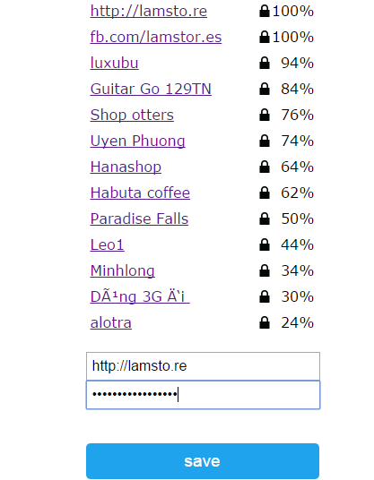

#Thư viện WiFiManager

Thư viện ManagerWifi hỗ trợ ESP8266 mở 1 webserver + 1 access point(AP), để user có thể kết nối vào và cấu hình wifi password.

Access point là một điểm truy cập mạng không dây,có khả năng truyền và nhận dữ liệu thông qua kết nốt Wifi.

#Nguyên lý làm việc của thư viên Wifi manarger

Khi khởi động,ESP sẽ ở chế độ Station(điểm thu sóng) và thử kết nối với các Access Point(điểm phát sóng) đã lưu trước đó.

Nếu không thể kết nối,ESP sẽ chuyển qua chế độ AP Và tạo một Webserve.Bạn có thể kết nối vào AP vừa được tạo và cấu hình Wifi cho ESP của bạn.

##Ví dụ Auto connect ứng dụng thư viện Wifimanager sử dụng board iot-Wifi-Uno và phần mềm Arduino IDE

##*Chuẩn bị
Boar iot-wifi-uno. [https://iotmaker.vn/](https://iotmaker.vn/).

Arduino IDE 1.6.8, tải từ [Arduino website](https://www.arduino.cc/en/Main/OldSoftwareReleases#previous).

##*Hướng dẫn


###1.Tải thư viên ManagerWifi:

Mở ARDUINO vào Sketch -> Include Library -> Manager Libraries.
Tìm kiếm thư viện WIFIManager và bấm install.


###2.Cài đặt board Generic ESP8266 MOdule:

Vào File->Preferences.

Trong ô Additional Boards Manager URLS paste Link sau:
```cpp
http://arduino.esp8266.com/stable/package_esp8266com_index.json
```


Vào Tool->Board->Board Manager.Tìm và cài đặt như hình 
Sau đó trong Tool -> Board tìm và chọn Board Generic ESP8266 Module


###3.Nạp code cho iot-wifi-uno

Sau khi cài đặt thư viện và Board,tiến hành nạp chương trình sau vào Board iot-wifi-uno.
```cpp
#include <ESP8266WiFi.h>          //https://github.com/esp8266/Arduino

//needed for library
#include <DNSServer.h>
#include <ESP8266WebServer.h>
#include <WiFiManager.h>         //https://github.com/tzapu/WiFiManager


void setup() {
    Serial.begin(115200);
    WiFiManager wifiManager;
    wifiManager.autoConnect("AutoConnectAP");
    Serial.println("connected...");
}

void loop() {
    // put your main code here, to run repeatedly:
    
}
```
###4.Kết nối với AP và cấu hình wifi:

Sau khi reset Board,trong Wifi của bạn sẽ xuất hiện 1 AP mới.Hãy chọn và kết nối như trong hình.


AP này là mạng wifi mở.
có thể cài đặt password cho AP bằng cách thay lệnh:

``` cpp wifiManager.autoConnect("AutoConnectAP")```

Bằng lệnh

``` cpp wifiManager.autoConnect("AutoConnectAP", "password")```
(password là mật khẩu bạn đặt cho AP)


Sử dụng thiết bị có thể kết nối wifi kết nối vào Access Point vừa được tạo.Bằng cách trên cửa sổ trình duyệt gõ địa chỉ ```192.168.4.1```.Sẽ hiện ra một cửa sổ cấu hình.

Chọn Configure WIFI sau đó chọn tên Wifi bạn muốn ESP truy cập,nhập mật khẩu vào bấm SAVE.


Sau đó,ESP sẽ tự động kết nối vào mạng Wifi bạn vừa chọn.

Như vậy ESP của bạn đã được kết nối với Wifi.

Để chắc chắn,có thể kiểm tra sử kết nối sử dụng phần mềm [`Wireless network watcher](http://taimienphi.vn/download-wireless-network-watcher-8128)


