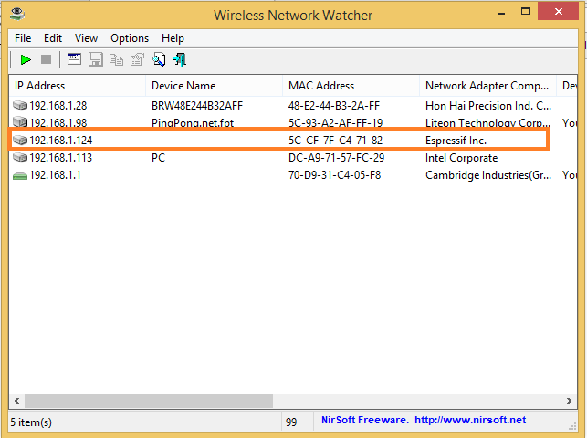

# Sử dụng thư viện WiFiManager

Thư viện ManagerWifi hỗ trợ ESP8266 mở 1 webserver + 1 access point(AP), để user có thể kết nối vào và cấu hình wifi password.

#Cách tải thư viên ManagerWifi:

Mở ARDUINO vào Sketch -> Include Library -> Manager Libraries.
Tìm kiếm thư viện esp8266wifi và bấm install.


#Thư viện Manager làm việc như thế nào?
##Ví dụ Auto connect sử dụng thư viện Managerwifi và ESP8266MOD AI THINKER.

Sau khi cài đặt thư viện bạn sử dụng ARDUINO IDE nạp chương trình sau vào AI THINKER:
```cpp
#include <ESP8266WiFi.h>          //https://github.com/esp8266/Arduino

//needed for library
#include <DNSServer.h>
#include <ESP8266WebServer.h>
#include <WiFiManager.h>         //https://github.com/tzapu/WiFiManager


void setup() {
    Serial.begin(115200);
    WiFiManager wifiManager;
    wifiManager.autoConnect("AutoConnectAP");
    Serial.println("connected...");
}

void loop() {
    // put your main code here, to run repeatedly:
    
}
```
Khi khởi động,ESP sẽ ở chế độ Station(thu sóng) và cố để kết nối với các Access Point(điểm phát sóng) đã lưu trước đó.

Nếu không thể kết nối,ESP sẽ chuyển sang chế độ Asccess Point và thiết lập 1 DNS và WebServer (IP mặc định là: 192.168.4.1).Bạn kêt nối với AP này:


AP này là mạng wifi mở.
có thể cài đặt password cho AP bằng cách thay lệnh:

``` cpp wifiManager.autoConnect("AutoConnectAP")```

Bằng lệnh

``` cpp wifiManager.autoConnect("AutoConnectAP", "password")```
(password là mật khẩu bạn đặt cho AP)


Sử dụng thiết bị có thể kết nối wifi kết nối vào Access Point vừa được tạo.Bằng cách trên cửa sổ trình duyệt gõ địa chỉ ```192.168.4.1```.Sẽ hiện ra một cửa sổ cấu hình.

Chọn Configure WIFI sau đó chọn tên Wifi bạn muốn ESP truy cập,nhập mật khẩu vào bấm SAVE.


Như vậy ESP của bạn đã được kết nối với Wifi.

Để chắc chắn,có thể kiểm tra sử kết nối sử dụng phần mềm `wireless network watcher`




