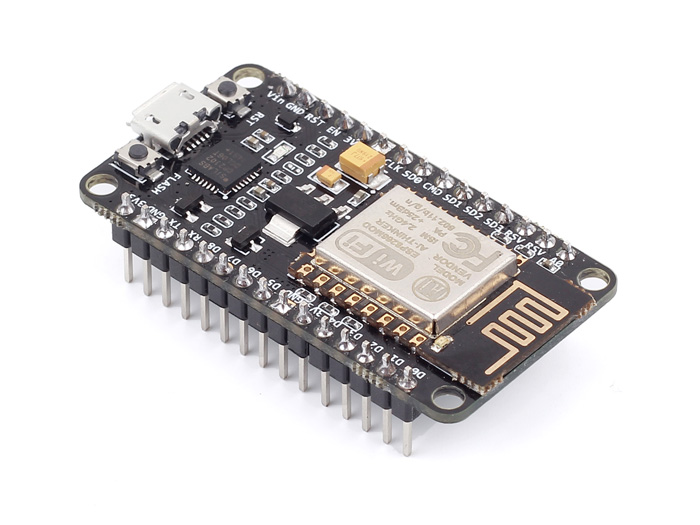

[TOC]
# Node MCU điều khiển bởi Slack

Dự án này sẽ thực hiện việc lập trình sử dụng NodeMCU đăng các thông báo lên facebook hỗ trợ những tính năng sau:

- Kết nối tới Server IFTTT
- Có cấu hình để gửi tin thông báo lên facebook
- Có thể cấu hình nội dung tin gửi

Video demo mô phỏng ứng dụng: 


## Cần chuẩn bị
- [NodeMCU](http://www.nodemcu.com) - bạn có thể mua ở Việt Nam tại: [!!btn btn-lg btn-outline|iotmaker.vn!!](https://iotmaker.vn)
- Cài đặt Arduino IDE và gói hỗ trợ ESP8266 [Hướng dẫn cài đặt](../basic/install.md)

## Mục đích của bài hướng dẫn này:

Sau khi lập trình lại cho thiết bị, thì thiết bị cần có những tính năng sau:

- Khi nhấn nút nhấn trên kit - đèn LED trạng thái sẽ chớp báo đang trong quá trình gửi dữ liệu lên facebook.
- Đèn LED sẽ tắt khi quá trình gửi dữ liệu hoàn thành.

Căn cứ trên yêu cầu và mạch nguyên lý bên dưới, chung ta cần những thông tin sau: 

| Chân   | Tính năng               |
|--------|-------------------------|
| GPIO16 | Điều khiển LED          |
| GPIO0  | Nút nhấn                |





## Đăng ký tài khoản IFTTT

### Đăng ký tài khoản Slack

- Vào trang [https://ifttt.com/](hhttps://ifttt.com/), điền Email vào tạo 1 tài khoản mới


### Khởi tạo New Applet

- Sau khi hoàn thành các bước đăng ký, chọn My Applets để tạo liên kết ứng dụng


- Applet hoạt động theo cấu trúc `if this then that` nghĩa là nếu có cái này thì thực hiện cái kia, ở đây là nếu NodeMCU/ESP8266 gửi request thì post status lên facebook.


- Click chọn Maker để nhận được tín hiệu từ NodeMCU/ESP8266


- Maker chỉ có 1 tùy chọn là Receive a web request nên ta chọn vào đó và điền tên tại Event Name, ở đây ta đặt tên là button_press, nghĩa là nếu ESP gửi sự kiện có tên là button_press lên thì sẽ post 1 bài lên facebook, sau đó chọn Create trigger


- Tiếp tục thêm facebook tại that, ở đây ta chọn facebook để đăng bài lên facebook cá nhân hoặc facebook page nếu bạn muốn post bài lên page


- Chọn Create a status mesage


- Chỉnh sửa nội dung tin bạn muốn đăng lên facebook tại Status mesage sau đó Create action


- Hoàn thành quá trình khởi tạo trên IFTTT


- Bạn sẽ cần `API Token` sau khi tạo xong My Applets bằng cách vào biểu tượng Maker hoặc link [https://ifttt.com/maker](https://ifttt.com/maker), mục Settings


- Key để access vào IFTTT nằm tại URL sau /use/xxxxx


## Chương trình 
```
git clone https://github.com/esp8266vn/facebook-post.git
```

!!! warning "Quan trọng"
    Phải thay đúng tên wifi, mật khẩu wifi và key IFTTT của bạn tại
    
    ```
    /****** Ket noi wifi **********/

    const char ssid[] = “ten_wifi”;

    const char password[] = “password”;

    // IFTTT setup

    const char *host = “maker.ifttt.com”;

    const char *Maker_Event = “button_press”; //Ten ban dat trong IFTT

    const char *Your_Key = “xxxxxxxxxxxxxx”; //API key cua app
    ```


## Kết quả
- Sau khi ấn nút chờ LED sáng lên và tắt thì ta có thể F5 lại facebook để thấy được post do NodeMCU đăng lên trên tường.


Lưu ý: Bạn có thể theo dõi log quá trình hoạt động của NodeMCU thông qua terminal của Arduino

## Link hữu ích  
- Mua hàng tại [IoT Maker Việt Nam](https://iotmaker.vn/nodemcu.html)
- [NodeMCU](http://www.nodemcu.com)
