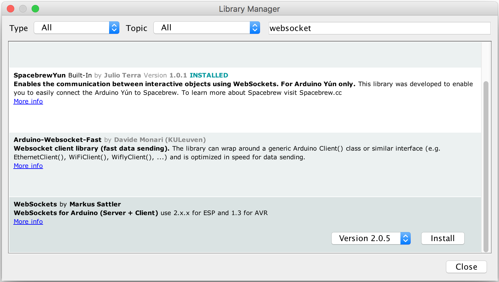
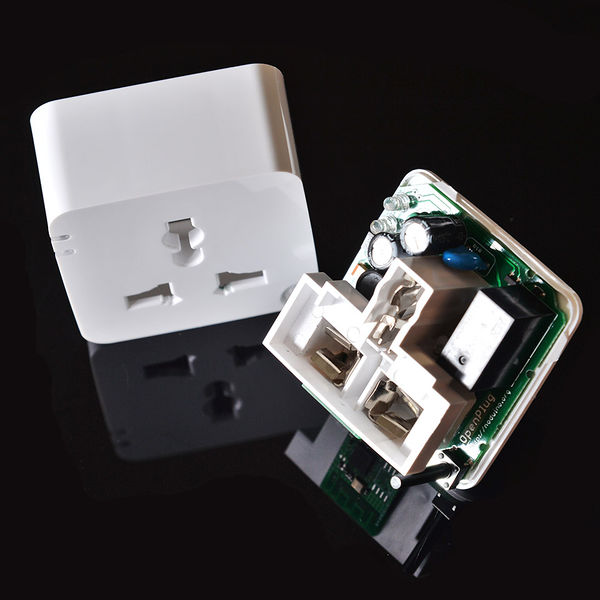
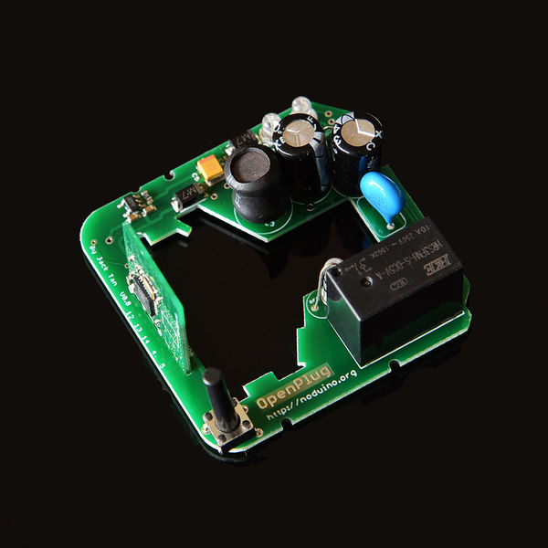
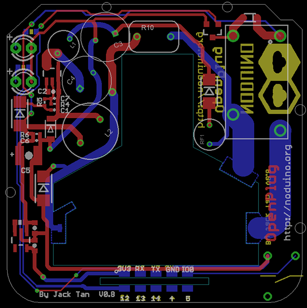
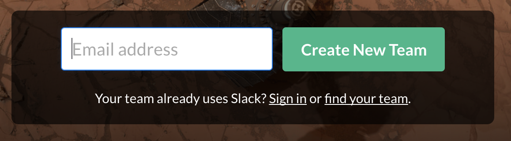
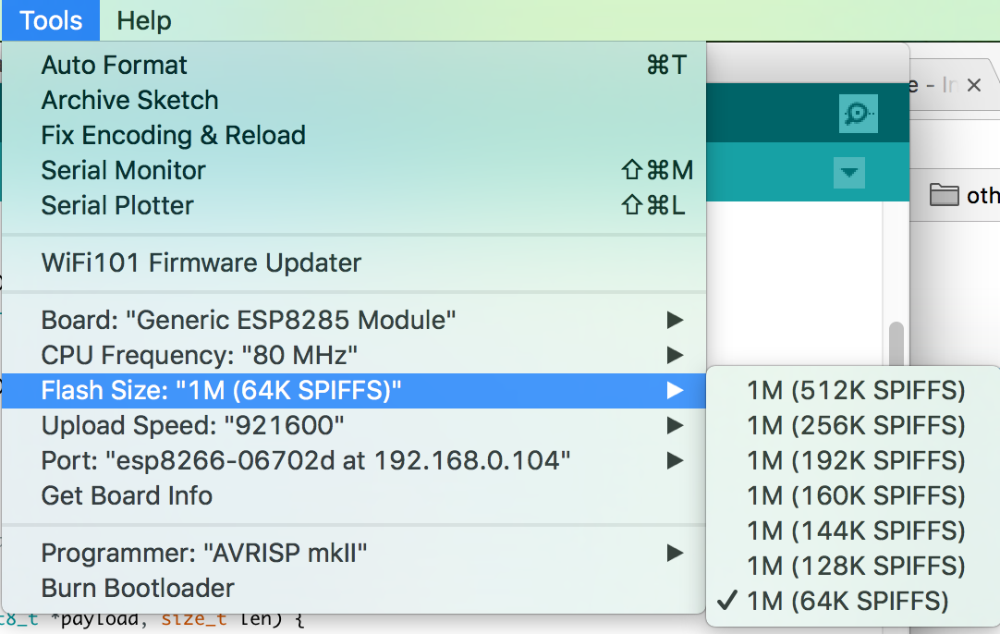

[TOC]
# Noduino Smart Plug điều khiển bởi Slack

Dự án này sẽ thực hiện việc lập trình lại Smart Plug bán sẵn trên thị trường [Noduino OpenPlug](http://noduino.org) hỗ trợ những tính năng sau:

- Kết nối tới Server của Slack như là một Slack Bot 
- Có thể điều khiển on/off từ ứng dụng Slack 
- Có thể cấu hình kết nối WiFi bằng smartconfig
- Có thể cập nhật firmware từ xa OTA thông qua Arduino IDE

Video demo mô phỏng ứng dụng: 

<iframe width="560" height="315" src="https://www.youtube.com/embed/hjNZVuSrc7c" frameborder="0" allowfullscreen></iframe>

## Cần chuẩn bị
- [Noduino OpenPlug](http://noduino.org) - bạn có thể mua ở Việt Nam tại: [!!btn btn-lg btn-outline|iotmaker.vn!!](https://iotmaker.vn) (Trong trường hợp bạn mua tại [iotmaker.vn](https://iotmaker.vn) plug đã được nạp sẵn firmware hỗ trợ OTA và smartconfig, có thể bỏ qua bước Đấu nối dây và nạp firmware hỗ trợ OTA)
- Mạch USB to TTL cho việc flash firmware đầu tiên 
- Cài đặt Arduino IDE và gói hỗ trợ ESP8266 [Hướng dẫn cài đặt](../basic/install.md)
- Cài đặt thư viện Websocket cho ESP8266 [arduinoWebSockets](https://github.com/Links2004/arduinoWebSockets)
- Tham khảo về OTA tại [ESP8266 Arduino OTA](../ota/arduino-fota.md)

Các bước chuẩn bị này coi như bạn đã hoàn thành - Nếu bạn không có **OpenPlug** có thể dùng các board phát triển như **Wemos**, **NodeMCU** để giả lập.

!!! note "Lưu ý"
    OpenPlug sử dụng **ESP8285** làm controller, giống hệt như **ESP8266** ngoại trừ việc nó có sẵn 1Mbytes Flash tích hợp. Giúp cho size của board nhỏ gọn hơn. Và board cắm trên OpenPlug là board [Noduino NODEC](https://iotmaker.vn/wireless/wi-fi/nodec/)

!!! warning "Hướng dẫn" 
    Bạn có thể cài đặt thư viện [arduinoWebSockets](https://github.com/Links2004/arduinoWebSockets) bằng cách sử dụng **Library Mangager** của Arduino, với từ khóa: `Websocket` và lựa chọn thư viện bên dưới.
    

## Mục đích của bài hướng dẫn này:

Sau khi lập trình lại cho thiết bị, thì thiết bị cần có những tính năng sau:

- Khi nhấn nút nhấn trên Plug - sau 5 giây, đèn LED trạng thái sẽ chớp nhanh liên tục, và thiết bị vào chế độ Smartconfig, sẵn sàng cho việc cài đặt Smartconfig. 
- Đèn LED sẽ sáng liên tục khi kết nối Wi-Fi thành công, chớp liên tục khi vào chế độ Smartconfig và chớp ngắt quãng nếu không thể kết nối tới Slack Server. 
- Có thể gởi lệnh `on` để bật và `off` để tắt thiết bị từ Ứng dụng Slack, trả về thông tin đã thực thi lệnh thành công hay chưa.

Căn cứ trên yêu cầu và mạch nguyên lý bên dưới, chung ta cần những thông tin sau: 

| Chân   | Tính năng               |
|--------|-------------------------|
| GPIO12 | Điều khiển Relay On/Off |
| GPIO3  | Điều khiển LED          |
| GPIO0  | Nút nhấn                |






## Sơ đồ nguyên lý và PCB của Open Plug 

[](images/open-plug-sch.png)

[](images/open-plug-pcb1.png)

## Đăng ký tài khoản Slack 

### Đăng ký tài khoản Slack

- Vào trang [https://slack.com/](https://slack.com/), điền Email vào tạo 1 team mới

- Sau khi tuần tự tiến hành các bước, thì bạn sẽ được hỏi đăng ký domain cho Team. Ở đây mình chọn là [https://smart-plug.slack.com](https://smart-plug.slack.com) - Đăng nhập bằng Email & Mật khẩu đã đăng ký. 

### Khởi tạo Slack Bot 

- Sau khi đăng ký xong, bạn có thể tạo Slack Bot cho Team, ở đây đặt là: `@myplug`:

[!!btn btn-lg btn-outline|Đăng ký Slack Bot!!](https://my.slack.com/services/new/bot)

- Bạn sẽ cần `API Token` sau khi tạo xong Slack Bot, trong như: 


- Cài đặt ứng dụng Slack (Hỗ trợ hầu hết các hệ điều hành cho máy tính và điện thoại di động):

[!!btn btn-lg btn-outline|Tải Slack!!](https://slack.com/downloads/osx) 

- Bạn phải đảm bảo Slack Bot đã hiển thị trong cửa sổ chat, như hình dưới đây, thì việc cài đặt Slack Bot đã thành công 


## Đấu nối dây và nạp firmware hỗ trợ OTA cho Open Plug  

Khi bạn thực hiện bước này xong, kể từ lần sau trở đi bạn không cần phải kết nối vật lý đến Open Plug, có thể nạp những firmware sau này thông qua WiFi. Tất nhiên, các đoạn code sau này của bạn phải đảm bảo logic OTA hoạt động đúng.

Sử dụng cổng UART2TTL để nạp 

```
USB2UART_GND ------> SmartNode_GPIO0
USB2UAR_GND -----> SmartNode_GND
USB2UAR_RXD -----> SmartNode_TX
USB2UAR_TXD -----> SmartNode_RX
```

!!! note "Notes"
    Hình chụp đấu đối thực tế sẽ được cung cấp sau

## Nạp Ứng dụng thông qua OTA 

```
git clone https://github.com/esp8266vn/smart-plug-slack
```

!!! warning "Quan trọng"
    Bởi vì chip trên Open Plug là `ESP8285` nên bộ nhớ chỉ có 1Mbytes Flash, trong khi dung lượng của Sketch này gần 400Kbytes. Vậy cần thêm 400Kbytes để dùng làm nơi lưu trữ. Chỉ được chọn vùng nhớ SPIFFS 64Kbytes mà thôi 
    

## Link hữu ích  
- [http://noduino.org](http://noduino.org) 
- Mua hàng tại [IoT Maker Việt Nam](https://iotmaker.vn/wireless/wi-fi/noduino-esp8285-wifi-open-plug/)
- Cám ơn tác giả [https://github.com/urish/arduino-slack-bot](https://github.com/urish/arduino-slack-bot)
