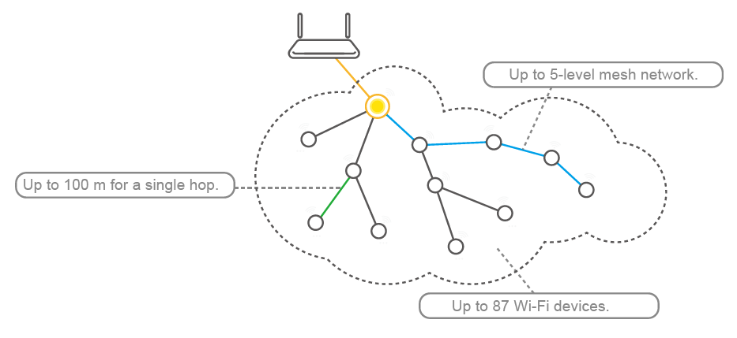
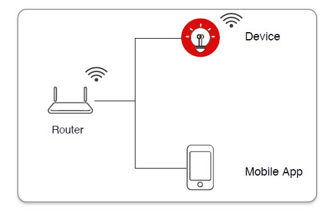
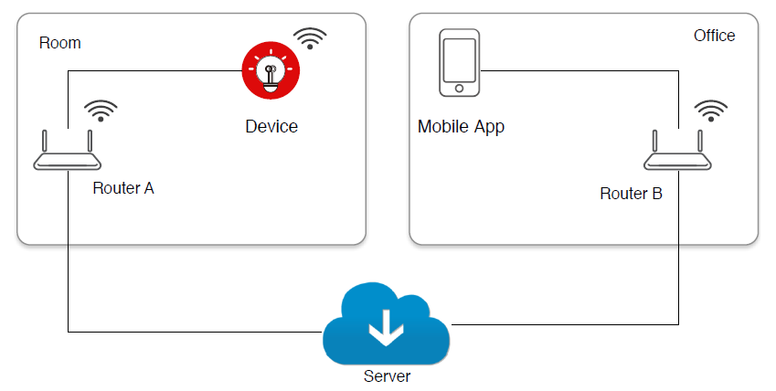
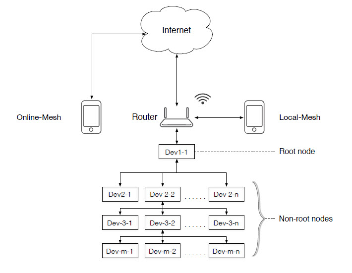
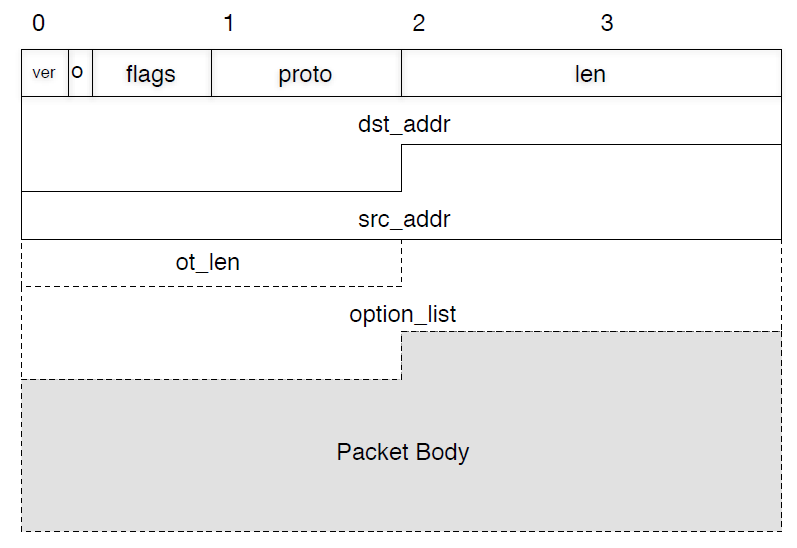

[TOC]

# Giới thiệu

Trong quá trình phát triển IoT thường đòi hỏi việc tăng số lượng node kết nối với Internet.Nhược điểm lớn nhất là số lượng node có thể trực tiếp kết nối tới router bị giới hạn nhỏ hơn 32 node. Để khắc phục điểm này thì Espressif đã phát triển giao thức ESP-MESH. Trong giao thức này node có thể tạo ra mạng để chuyển tiếp gói tin, nhờ đó mà một số lượng lớn node có thể kết nối Internet mà không cần phải cải tiến, nâng cấp router.

# Một số định nghĩa
- IOT Espressif App: ứng dụng của Espressif dùng để điều khiển từ xa các thiết bị Wifi
- ESP-Touch: công nghệ để kết nối Wifi device với router
- Smart Config Mode cho ESP-Touch: cấu hình cho Wifi device dùng ESP-Touch thông qua Mode Smart Config.
- Local Device: thiết bị được người dùng cấu hình kết nối với router thông qua ESP-Touch mà không kích hoạt trên server, chỉ có thể điều khiển thông qua mạng cục bộ


- Cloud Device: giống như Local Device nhưng được kích hoạt trên server, có thể điều khiển ở mọi nơi có mạng internet.


# Cấu trúc mạng
Mạng Mesh hỗ trợ chức năng auto-networking. Khi người dùng thiết lập mạng mesh thông qua ESP-Touch thì thiết bị sẽ tự động tìm các Wifi AP gần kề.

## Sơ đồ mạng mesh



- Các node sẽ kết nối trực tiếp tới router được gọi là root node, các node khác thì được gọi là non-root node.
- Online-Mesh: Khi router kết nối với internet thì ta có thể dùng IOT App để điều khiển từ xa ở bất kỳ đâu
- Local-Mesh: Bạn chỉ có thể điều khiển Local Device trong mạng thông qua router.

## Các node trong mạng
- Root Node
    + Nhận và gửi gói tin
    + Chuyển tiếp gói tin từ server, ứng dụng mobile và các node con của nó
- None-root Node
    + Non-leaf node: Nhận và gửi gói tin, chuyển tiếp gói tin từ node cha và các node con khác
    + Leaf node: Chỉ được nhận và gửi gói tin, không có chức năng chuyển tiếp.

# Các header trong Mesh


Mô tả

| Tên trường  | Độ dài                | Mô tả                                                    |
|-------------|-----------------------|----------------------------------------------------------|
| ver         | 2 bit                 | Thông tin Mesh                                           |
| o           | 1 bit                 | Tùy chọn flag                                            |
| flags       | 5 bit                 | FP|FR|resv|resv|resv                                     |
|             | FP                    | Cho phép Piggyback flow trong gói tin                    |
|             | FR                    | Yêu cầu,Piggyback flow trong gói tin                     |
|             | resv                  | Dự phòng                                                 |
|             | 8 bit                 | D|P2P|Protocol                                           |
|             | D                     | Chiều của gói tin: 0: xuống (downward) 1: lên (upward)   |
|             | P2P                   | Gói tin từ Node tới Node                                 |
|             | protocol              | Giao thức gửi dữ liệu được quy định bởi người dùng(6bit) |
| len         | 2 byte                | Chiều dài của gói tin (bao gồm cả mesh header)           |
| dst_addr    | 6 bytes               | Địa chỉ đích                                             |
| src_addr    | 6 bytes               | Địa chỉ nguồn                                            |
| ot_len      |                       | Độ dài của option (gồm cả chính nó)                      |
| option_list |                       | Danh sách các thành phần của các option                  |
| otype       | 1 byte                | Kiểu option                                              |
| olen        | 1 byte                | Chiều dài của option hiện tịa                            |
| ovalue      | Người dùng định nghĩa | Giá trị option hiện tại                                  |

# Cấu trúc gói tin

Mạng mesh được định nghĩa bởi cấu trúc trong mesh_option_type

```
    enum mesh_option_type {
    M_O_FLOW_REQ = 0,   //flow request option
    M_O_FLOW_RESP,      //flow response option
    M_O_ROUTER_SPREAD,  //router information spread option
    M_O_ROUTE_ADD,      //route table update (node joins mesh) option
    M_O_ROUTE_DEL,      //route table update (node exits mesh) option
    M_O_TOPO_REQ,       //topology request option
    M_O_TOPO_RESP,      //topology response option
    M_O_MCAST_GRP,      //group list of mcast
    M_O_MESH_FRAG,      //mesh management fragmentation option
    M_O_USR_FRAG,       //user data fragmentation
    M_O_USR_OPTION,     //user option
    };
```

| Tên trường        | Độ dài     | Mô tả                                                              | Định dạng         |
|-------------------|------------|--------------------------------------------------------------------|-------------------|
| M_O_FLOW_REQ      | 2 Bytes    | Dùng cho flow request                                              | otype|olen|ovalue |
| M_O_FLOW_RESP     | 6 Bytes    | Dùng cho phản hồi tới flow                                         | otype|olen|ovalue |
| M_O_ROUTER_SPREAD | 106 Bytes  | Dùng spread thông tin từ router                                    | otype|olen|ovalue |
| M_O_ROUTE_ADD     | 6*n+2Bytes | Dùng để cập nhật bảng định tuyến khi có node mới tham gia vào mạng | otype|olen|ovalue |
| M_O_ROUTE_DEL     | 6*n+2Bytes | Dùng để cập nhật bảng định tuyến khi có node rời mạng              | otype|olen|ovalue |
| M_O_TOPO_REQ      | 8 Bytes    | Sử dụng để lấy topo của mạng mesh                                  | otype|olen|ovalue |
| M_O_TOPO_RESP     | 6*n+2Bytes | Sử dụng để nhận phản hồi topo của mạng mesh                        | otype|olen|ovalue |

# Ví dụ gói tin gửi/ nhận

### Gói tin request

|           | 0  | 1  | 2  | 3  | 4  | 5  | 6  | 7  | 8  | 9  | a  | b  | c  | d  | e  | f  |
|-----------|----|----|----|----|----|----|----|----|----|----|----|----|----|----|----|----|
| 00000000h | 04 | 01 | 14 | 00 | 18 | FE | 34 | A5 | 3B | AD | 18 | FE | 34 | A2 | C7 | 76 |
| 00000010h | 04 | 00 | 00 | 02 |    |    |    |    |    |    |    |    |    |    |    |    |

Mô tả

| Tên trường                | Giá trị           | Mô tả                              |
|---------------------------|-------------------|------------------------------------|
| head.ver                  | 00                | Phiên bản hiện tại của mesh là 00  |
| head.O                    | 1                 | Có option trong gói tin            |
| head.flags.FP             | 0                 | Không có piggyback flow permit     |
| head.flags.FR             | 0                 | Không có piggyback flow request    |
| head.flags.resv           | 000               | Dự phòng                           |
| head.proto.D              | 1                 | Upwards                            |
| head.proto.P2P            | 0                 | Không có gói từ node tới node      |
| head.proto.protocol       | 000000            | Gói tin quản lý mesh               |
| head.len                  | 0x0014            | Chiều dài của gói tin là 20 byte   |
| head.dst_addr             | 18 FE 34 A5 3B AD | Địa chỉ MAC của destination device |
| head.src_addr             | 18 FE 34 A2 C7 76 | Địa chỉ MAC của source device      |
| head.ot_len               | 0x0004            | Chiều dài của option là 0x0004     |
| head.option_list[0].otype | 0x00              | M_FLOW_REQ                         |
| head.option_list[0].olen  | 0x02              | Option length là 0x02              |

# Gói tin response

|           | 0  | 1  | 2  | 3  | 4  | 5  | 6  | 7  | 8  | 9  | a  | b  | c  | d  | e  | f  |
|-----------|----|----|----|----|----|----|----|----|----|----|----|----|----|----|----|----|
| 00000000h | 04 | 00 | 18 | 00 | 18 | FE | 34 | A2 | C7 | 76 | 18 | FE | 34 | A5 | 3B | AD |
| 00000010h | 08 | 00 | 01 | 06 | 01 | 00 | 00 | 00 |    |    |    |    |    |    |    |    |

Mô tả

| Tên trường                 | Giá trị           | Mô tả                                                    |
|----------------------------|-------------------|----------------------------------------------------------|
| head.ver                   | 00                | Phiên bản hiện tại của mesh là 00                        |
| head.O                     | 1                 | Có option trong gói tin                                  |
| head.flags.FP              | 0                 | Không có piggyback flow permit                           |
| head.flags.FR              | 0                 | Không có piggyback flow request                          |
| head.flags.resv            | 000               | Dự phòng                                                 |
| head.proto.D               | 0                 | Downwards.                                               |
| head.proto.P2P             | 0                 | Không có gói từ node tới node                            |
| head.proto.protocol        | 000000            | Gói tin quản lý mesh                                     |
| head.len                   | 0x0015            | Chiều dài của gói tin là 21 byte                         |
| head.dst_addr              | 18 FE 34 A2 C7 76 | Địa chỉ MAC của destination device                       |
| head.src_addr              | 18 FE 34 A5 3B AD | Địa chỉ MAC của source device                            |
| head.ot_len                | 0x0008            | Chiều dài của option là 0x0008                           |
| head.option_list[0].otype  | 0x01              | M_FLOW_RESP                                              |
| head.option_list[0].olen   | 0x06              | Option length là 0x06                                    |
| head.option_list[0].ovalue | 0x01              | Option value là 0x00000001, flow capacity là 0x00000001. |

# Cấu trúc dữ liệu

- Định dạng mesh header 

```
struct mesh_header_format {
    uint8_t ver: 2; // version of mesh
    uint8_t oe: 1; // option flag
    uint8_t fp: 1; // piggyback flow permit in packet
    uint8_t fr: 1; // piggyback flow request in packet
    uint8_t rsv: 3; // reserved
    struct {
        uint8_t d: 1; // direction, 1:upwards, 0:downwards
        uint8_t p2p: 1; // node to node packet
        uint8_t protocol: 6; // protocol used by user data
    } proto;
    uint16_t len; // packet total length
    (mesh header included)
    uint8_t dst_addr[ESP_MESH_ADDR_LEN]; // destination address
    uint8_t src_addr[ESP_MESH_ADDR_LEN]; // source address
    struct mesh_header_option_header_type option[0]; // mesh option
} __packed;
```

- Định dạng mesh Option header 

```
struct mesh_header_option_header_type {
    uint16_t ot_len; // option total length
    struct mesh_header_option_format olist[0]; // option list
} __packed;
```

- Định dạng mesh Option 

```
struct mesh_header_option_format {
    uint8_t otype; // option type
    uint8_t olen; // current option length
    uint8_t ovalue[0]; // option value
} __packed;
```

- Định dạng mesh Option Fragmentation

```
struct mesh_header_option_frag_format {
    uint16_t id; // identity of fragmentation
    struct {
        uint16_t resv: 1; // reserved
        uint16_t mf: 1; // more fragmentation
        uint16_t idx: 14; // fragmentation offset
    } offset;
} __packed;
```

- Định dạng Mesh Callback

```
typedef void (* espconn_mesh_callback)(int8_t result);
```

- Định dạng Mesh Scan Callback

```
typedef void (* espconn_mesh_scan_callback)(void *arg, int8_t
status);
```

- Định dạng Mesh Scan User Callback

```
typedef void (* espconn_mesh_usr_callback)(void *arg);
```
!!! note "Lưu ý"
    Các API của packet có thể tham khảo tại [API](http://www.espressif.com/en/support/download/documents#overlay=en/admin/content)

# Chương trình

## Device

## Mobile hoặc Server

```
void controller_entrance(Parameter list)
{
    /*Add your codes to check status*/
    /*Add your codes to build control packet*/
    uint8_t json_control_data[] = {/*Add your codes*/};
    uint16_t control_data_len = sizeof(json_control_data)
                                struct mesh_header_format * mesh_header = NULL;
    /* src_addr should be the combination of IP and port of
    Mobile or Server. You can set the address to zero, then the
    root device will fill in the section. If you fill in the
    section by yourself, please make sure the value is right.*/
    uint8_t src_addr[] = {0, 0, 0, 0, 0, 0},
                         dst_addr[] = {xx, xx, xx, xx, xx, xx};
    mesh_header = (struct mesh_header_format
                   *)espconn_mesh_create_packet(dst_addr, src_addr, false, true,
                           M_PROTO_JSON, control_data_len,
                           false, 0, false, 0, false, 0, 0);
    if (!mesh_header)
    {
        printf(“alloc resp packet fail\n”);
        return;
    }
    if (espconn_mesh_set_usr_data(mesh_header,
                                  resp_json_packet_body, resp_data_len))
    {
        printf(“set user data fail\n”);
        free(mesh_header);
        return;
    }
// sent control packet
    espconn_mesh_sent(esp, mesh_header, mesh_header->len);
    free(mesh_header);
}
```

# Lấy topology

```
void topology_entrance(Parameter list)
{
    /*Add your codes to check status*/
    /*Add your codes to build getting topology packet*/
    bool res;
    struct mesh_header_format *mesh_header = NULL;
    struct mesh_header_option_format *topo_option = NULL;
    uint8_t src_addr[] = {0, 0, 0, 0, 0, 0};
    uint8_t dst_addr[] = {xx, xx, xx, xx, xx, xx}; // MAC address of root
    device
    uint8_t dev_mac[6] = {xx, xx, xx, xx, xx, xx}; // zero represents
    topology of all devices
    uint16_t ot_len = sizeof(*topo_option) + sizeof(struct
                      mesh_header_option_header_type) + sizeof(dev_mac);
    mesh_header = (struct mesh_header_format
                   *)espconn_mesh_create_packet(
                      dst_addr, src_addr, false, true, M_PROTO_NONE, 0,
                      true, ot_len, false, 0, false, 0, 0);
    if (!mesh_header) {
        printf(“alloc resp packet fail\n”);
        return;
    }
    topo_option = (struct mesh_header_option_format
                   *)espconn_mesh_create_option(
                      M_O_TOPO_REQ, dev_mac, sizeof(dev_mac));
    if (!topo_option) {
        printf(“alloc topo option fail\n”);
        free(mesh_header);
        return;
    }
    res = espconn_mesh_add_option(mesh_header, topo_option);
    free(topo_option);
    if (res) {
        printf(“add topo option fail\n”);
        free(mesh_header);
        return;
    }
// send packet of getting topology
    espconn_mesh_sent(esp, mesh_header, mesh_header->len);
    free(mesh_header);
}
```

# Phân tích phản hồi từ topology

```
void topology_parser_entrance(uint8_t *topo_resp, uint16_t len)
{
    /*Add your codes to check parameter*/
    uint16_t oidx = 1;
    struct mesh_header_format *mesh_header = NULL;
    struct mesh_header_option_format *topo_option = NULL;
    mesh_header = (struct mesh_header_format *)topo_resp;
    if (!mesh_header->oe) {
        printf(“no option exist\n”);
        return;
    }
    /* you need parse all the options one by one in the packet header
    */
    while (espconn_mesh_get_option(mesh_header, M_O_TOPO_RESP,
                                   oidx++, &topo_option)) {
        uint16_t dev_count = topo_option->olen / 6;
        process_dev_list(topo_option->ovalue, dev_count);
    }
}
```

# Tham khảo
- [ESP-MESH](https://espressif.com/en/products/software/esp-mesh/overview)