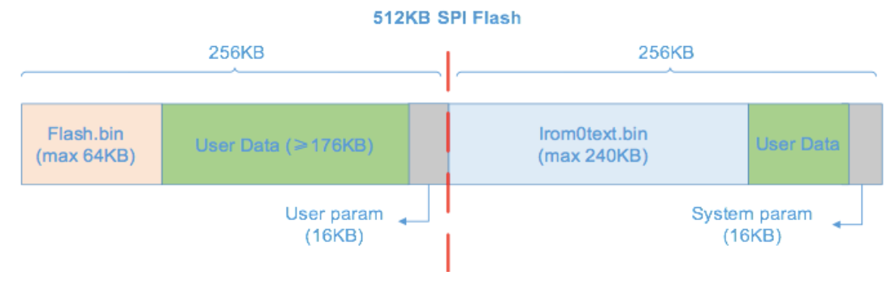
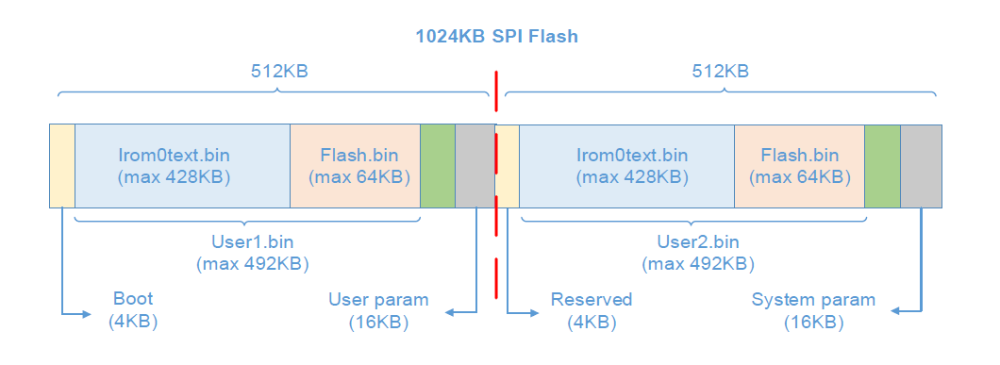
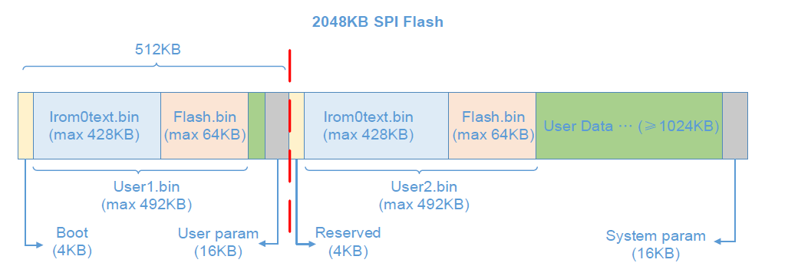
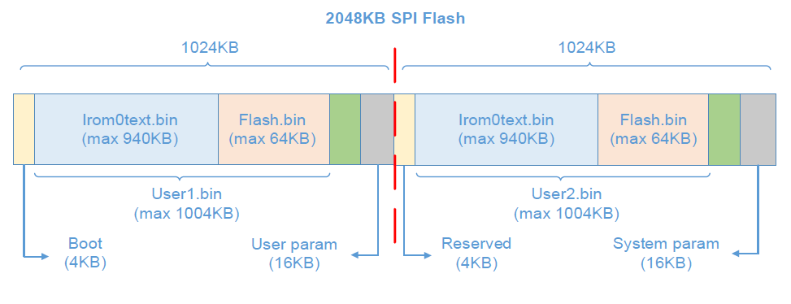
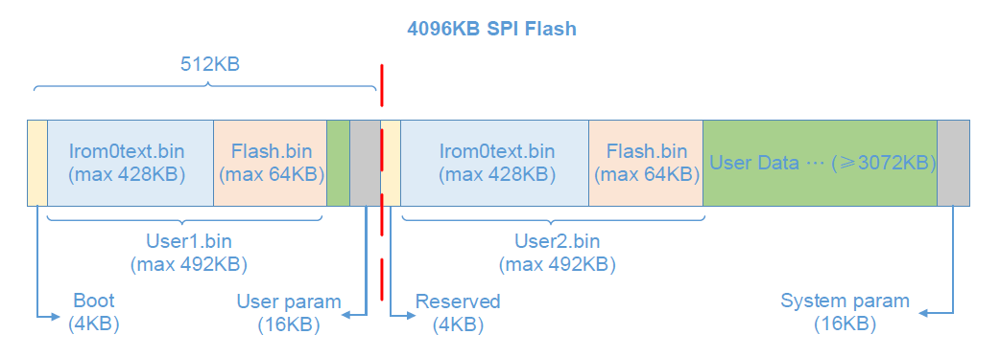
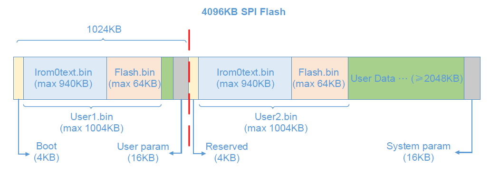
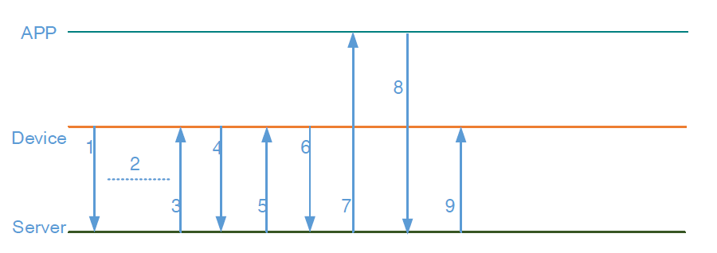

# Giới thiệu
FOTA là Firmware Over The Air, với FOTA thì chúng ta có thể cập nhật firmware từ xa thông qua mạng cho ESP mà không cần kết nối cổng nạp giữa ESP và máy tính.
Để thực hiện FOTA cần tạo 2 file để nạp vào flash
- boot.bin được ghi vào địa chỉ 0x00000
- user1.bin được ghi vào địa chỉ 0x01000

# Flash
Tùy theo dung lượng flash của các phiên bản ESP8266 mà có các flash khác nhau

## 512KB Flash

| Sector      | Mô tả                                                      | Region      | Kích thước |
|-------------|------------------------------------------------------------|-------------|------------|
| Boot        | Lưu boot.bin                                               | 0~4KB       | 4KB        |
| User APP1   | Lưu user1.bin(=flash.bin+irom0text.bin)                    | 4KB~240KB   | 236KB      |
| User param  | Lưu thông số do người dùng đặt(4x4KB)                      | 240KB~256KB | 16KB       |
| Reverse     | Dự phòng, cần phải đưa user2 và user1 cùng offset(0x01000) | 256KB~260KB | 4KB        |
| User APP2   | Lưu user2.bin(flash.bin+irom0text.bin)                     | 260KB~496KB | 236KB      |
| Sysem param | Lưu thông số hệ thống (4x4KB)                              | 496KB~512KB | 16KB       |

User App1 và User App2 được tạo ra trong quá trình biên dịch và nạp file user1.bin, user2.bin
File flash.bin và irom0text.bin sẽ được kết hợp với user1.bin(hoặc user2.bin) để cập nhật. Một file user.bin sẽ được backup lại trong quá trình cập nhật fail
File bootloader (boot.bin) sẽ kiểm tra cờ trong thông số System để xác định là sẽ thực hiện User App1(user1.bin) hay User App2(user2.bin)

**Ví dụ:**
Dưới đây là ví dụ minh họa về các bước của FOTA

1. Đầu tiên là nạp file boot.bin và user1.bin (phiên bản v1.0.0) xuống ESP8266. Cờ của vùng system param sẽ chọn user1.bin là mặc định. Sau khi khởi động hệ thống sẽ tự động nhảy vào user1.bin
2. Upload 2 file user1.bin và user2.bin (phiên bản 1.0.1) lên cloud hoặc server riêng
3. Server sẽ gửi tin nhắn xuống ESP là đã có update mới. Nếu ESP nhận được tin nhắn này sẽ kiểm tra cờ đầu tiên, cờ này sẽ đặt là user1, sau đó tải user2.bin của v1.0.1 xuống flash ở vùng từ 260KB~496KB để cập nhật.
4. Sau khi tải xong, người dùng sẽ nhận được tin nhắn của FOTA có cho phép update hay không. Nếu có sẽ đổi cờ sang user2 và khởi động lại chạy với user2.bin. Nếu không thì không có gì xảy ra cả
5. Lần cập nhật tới, bắt đầu với bước 2, sau đó tải user1.bin của phiên bản v1.0.2 và flash vào vùng 4KB~240KB thay thế cho phiên bản user1.bin của bản v1.0.0

**Lưu ý**
- Cần tạo ra 2 file user1.bin và user2.bin trong quá trình biên dịch và upload cả 2 file này lên server. ESP sẽ tự xác định file bin nào cần download.
- Sự khác nhau của user1.bin và user2.bin là phân vùng địa chỉ được lưu trong flash.
- Thông thường file user1.bin sẽ được nạp vào flash trước. sau đó cập nhật phiên bản user2.bin thông qua wifi

## 1024KB Flash và các Flash lớn hơn
Cách làm tương tự như với 512KB Flash nhưng cách phân chia các phân vùng sẽ khác nhau

### 1024KB Flash

### 2048KB Flash

### 4096KB Flash

# Hoạt động

1. Khi hoạt động thì ESP sẽ gửi thông tin về phiên bản hiện tại lên server và server sẽ lưu thông tin này lại
2. Hoạt động bình thường
3. Khi có một firmware mới được up lên server. Server sẽ gửi thông báo tới ESP
4. ESP sẽ yêu cầu firmware thông qua device key và đường dẫn upload (user1.bin hoặc user2.bin)
5. Tải firmware về flash
6. Gửi thông tin tải xong cho server
7. Server gửi thông báo cho APP, APP sẽ hiển thị thông tin cho người dùng
8. APP sẽ gửi thông tin quyết định của người dùng có cập nhật không tới server
9. Server gửi quyết định của người dùng tới ESP
Thông tin kết nối giữa device(ESP8266), các dịch vụ và APP được mã hóa SSL do đó quá trình được đảm bảo an toàn.

# Tham khảo
- [ESP8266 FOTA](http://www.espressif.com/sites/default/files/99c-esp8266_ota_upgrade_en_v1.6.pdf)