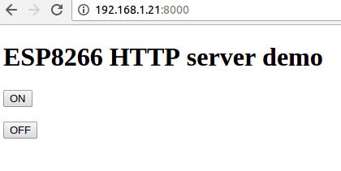

[TOC]

# Điều khiển LED qua webserver

Tổ chức file căn cứ theo bài [Biên dịch dự án đầu tiên](./compile-first-time.md), toàn bộ cấu trúc file, **Makefile, user_config.h, rf_init.c** giữ nguyên, chỉ thay đổi nội dung file `main.c`. 

!!! note "Nội dung"
    Tạo một webserver cho phép người dùng bật tắt LED từ xa

## Lấy dự án về từ Github 

```bash
git clone https://github.com/esp8266vn/esp-iot-http-server.git
cd esp-iot-http-server && make
```

## Sơ đồ file

```
esp-iot-led-blink
    |-- Makefile
    |-- main.c
    |-- rf_init.c
    `-- user_config.h
```

## Mã nguồn

```c
#include "ets_sys.h"
#include "osapi.h"
#include "user_interface.h"
#include "espconn.h"
#include "mem.h"
    
LOCAL struct espconn esp_conn;
LOCAL esp_tcp esptcp;
    
#define SERVER_LOCAL_PORT         8000

char *index_html =
"<!DOCTYPE html>\r\n"
"<html>\r\n"
"<body>\r\n"
"\r\n"
"<h1>ESP8266 HTTP server demo </h1>\r\n"
"<button type='button' onclick='led_on()'>ON</button><br>\r\n"
"<br>\r\n"
"<button type='button' onclick='led_off()'>OFF</button><br>\r\n"
" \r\n"
"<script>\r\n"

"function led_on() {\r\n"
"  var xhttp;\r\n"
"  if (window.XMLHttpRequest) {\r\n"
"    // code for modern browsers\r\n"
"    xhttp = new XMLHttpRequest();\r\n"
"    } else {\r\n"
"    // code for IE6, IE5\r\n"
"    xhttp = new ActiveXObject(\"Microsoft.XMLHTTP\");\r\n"
"  }\r\n"
"  xhttp.open(\"GET\", 'led_on', true);\r\n"
"  xhttp.send();\r\n"
"}\r\n"

"function led_off() {\r\n"
"  var xhttp;\r\n"
"  if (window.XMLHttpRequest) {\r\n"
"    // code for modern browsers\r\n"
"    xhttp = new XMLHttpRequest();\r\n"
"    } else {\r\n"
"    // code for IE6, IE5\r\n"
"    xhttp = new ActiveXObject(\"Microsoft.XMLHTTP\");\r\n"
"  }\r\n"
"  xhttp.open(\"GET\", 'led_off', true);\r\n"
"  xhttp.send();\r\n"
"}\r\n"

"</script>\r\n"
"\r\n"
"</body>\r\n"
"</html>\r\n";

/******************************************************************************
    * FunctionName : led_init
    * Description     : led initialization.
    * Parameters         : none
    * Returns         : none
*******************************************************************************/
void ICACHE_FLASH_ATTR
led_init(void)
{
    WRITE_PERI_REG(PAD_XPD_DCDC_CONF, (READ_PERI_REG(PAD_XPD_DCDC_CONF) & 0xffffffbc) | (uint32_t)0x1);  
    WRITE_PERI_REG(RTC_GPIO_CONF, (READ_PERI_REG(RTC_GPIO_CONF) & (uint32_t)0xfffffffe) | (uint32_t)0x0);
    WRITE_PERI_REG(RTC_GPIO_ENABLE, (READ_PERI_REG(RTC_GPIO_ENABLE) & (uint32_t)0xfffffffe) | (uint32_t)0x1);
}

/******************************************************************************
    * FunctionName : led_set
    * Description     : set led state according to led_value value.
    * Parameters         : led_value - led state to be set
    * Returns         : none
*******************************************************************************/
void ICACHE_FLASH_ATTR
led_set(uint8_t led_value)
{
    WRITE_PERI_REG(RTC_GPIO_OUT, (READ_PERI_REG(RTC_GPIO_OUT) & (uint32_t)0xfffffffe)| (uint32_t)(led_value & 1));
}

/******************************************************************************
    * FunctionName : http_response
    * Description     : send the html body with the html header.
    * Parameters         :  pespconn - espconn of the http server
    *                       error - status code
    *                       html_txt - the buffer which contents the html file
    * Returns         : none
*******************************************************************************/
LOCAL void ICACHE_FLASH_ATTR
http_response(struct espconn *pespconn, int error, char *html_txt)
{
    char *buffer = NULL;
    int html_length = 0;
    buffer = (char *)os_malloc(256 * sizeof(char));
    if(buffer != NULL)
    {
        if(html_txt != NULL)
        {
            html_length = os_strlen(html_txt);
        }
        else
        {
            html_length = 0;
        }

        os_sprintf(buffer, "HTTP/1.1 %d OK\r\n"
                            "Content-Length: %d\r\n"
                            "Content-Type: text/html\r\n"
                            "Connection: Closed\r\n"
                            "\r\n"
        ,error, html_length);

        if(html_length > 0)
        {
            buffer = (char *)os_realloc(buffer, (256 + html_length) *sizeof(char));
            os_strcat(buffer, html_txt);
        }

        espconn_sent(pespconn, buffer, strlen(buffer));
        os_free(buffer);
    }
}

/******************************************************************************
    * FunctionName : tcp_server_sent_cb
    * Description     : data sent callback.
    * Parameters         : arg -- Additional argument to pass to the callback function
    * Returns         : none
*******************************************************************************/
LOCAL void ICACHE_FLASH_ATTR
tcp_server_sent_cb(void *arg)
{
    //data sent successfully
    
    os_printf("tcp sent cb \r\n");
}
    
    
/******************************************************************************
    * FunctionName : tcp_server_recv_cb
    * Description     : receive callback.
    * Parameters         : arg -- Additional argument to pass to the callback function
    * Returns         : none
*******************************************************************************/
LOCAL void ICACHE_FLASH_ATTR
tcp_server_recv_cb(void *arg, char *pusrdata, unsigned short length)
{
    char *ptr = 0;
    //received some data from tcp connection
    
    struct espconn *pespconn = arg;
    // os_printf("tcp recv : %s \r\n", pusrdata);
    ptr = (char *)os_strstr(pusrdata, "\r\n");
    ptr[0] = '\0';
    if (os_strcmp(pusrdata, "GET / HTTP/1.1") == 0)
    {
        http_response(pespconn, 200, index_html);
    }
    else if (os_strcmp(pusrdata, "GET /led_on HTTP/1.1") == 0)
    {
        os_printf("led_on\r\n");
        led_set(0);
        http_response(pespconn, 200, NULL);
    } 
    else if (os_strcmp(pusrdata, "GET /led_off HTTP/1.1") == 0)
    {
        os_printf("led_off\r\n");
        led_set(1);
        http_response(pespconn, 200, NULL);
    }
}
    
/******************************************************************************
    * FunctionName : tcp_server_discon_cb
    * Description     : disconnect callback.
    * Parameters         : arg -- Additional argument to pass to the callback function
    * Returns         : none
*******************************************************************************/
LOCAL void ICACHE_FLASH_ATTR
tcp_server_discon_cb(void *arg)
{
    //tcp disconnect successfully
    
    os_printf("tcp disconnect succeed !!! \r\n");
}
    
/******************************************************************************
    * FunctionName : tcp_server_recon_cb
    * Description     : reconnect callback, error occured in TCP connection.
    * Parameters         : arg -- Additional argument to pass to the callback function
    * Returns         : none
*******************************************************************************/
LOCAL void ICACHE_FLASH_ATTR
tcp_server_recon_cb(void *arg, sint8 err)
{
    //error occured , tcp connection broke. 
    
    os_printf("reconnect callback, error code %d !!! \r\n",err);
}

/******************************************************************************
    * FunctionName : tcp_server_listen
    * Description     : TCP server listened a connection successfully
    * Parameters         : arg -- Additional argument to pass to the callback function
    * Returns         : none
*******************************************************************************/
LOCAL void ICACHE_FLASH_ATTR
tcp_server_listen(void *arg)
{
    struct espconn *pesp_conn = arg;
    os_printf("tcp_server_listen !!! \r\n");
    
    espconn_regist_recvcb(pesp_conn, tcp_server_recv_cb);
    espconn_regist_reconcb(pesp_conn, tcp_server_recon_cb);
    espconn_regist_disconcb(pesp_conn, tcp_server_discon_cb);
        
    espconn_regist_sentcb(pesp_conn, tcp_server_sent_cb);
}
    
/******************************************************************************
    * FunctionName : user_tcpserver_init
    * Description     : parameter initialize as a TCP server
    * Parameters         : port -- server port
    * Returns         : none
*******************************************************************************/
void ICACHE_FLASH_ATTR
user_tcpserver_init(uint32 port)
{
    esp_conn.type = ESPCONN_TCP;
    esp_conn.state = ESPCONN_NONE;
    esp_conn.proto.tcp = &esptcp;
    esp_conn.proto.tcp->local_port = port;
    espconn_regist_connectcb(&esp_conn, tcp_server_listen);
    
    sint8 ret = espconn_accept(&esp_conn);
        
    os_printf("espconn_accept [%d] !!! \r\n", ret);
    
}
LOCAL os_timer_t test_timer;
    
/******************************************************************************
    * FunctionName : user_esp_platform_check_ip
    * Description     : check whether get ip addr or not
    * Parameters         : none
    * Returns         : none
*******************************************************************************/
void ICACHE_FLASH_ATTR
user_esp_platform_check_ip(void)
{
    struct ip_info ipconfig;
    
    //disarm timer first
    os_timer_disarm(&test_timer);
    
    //get ip info of ESP8266 station
    wifi_get_ip_info(STATION_IF, &ipconfig);
    
    if (wifi_station_get_connect_status() == STATION_GOT_IP && ipconfig.ip.addr != 0) {
    
            os_printf("got ip !!! \r\n");
            user_tcpserver_init(SERVER_LOCAL_PORT);
    
    } else {
        
        if ((wifi_station_get_connect_status() == STATION_WRONG_PASSWORD ||
                wifi_station_get_connect_status() == STATION_NO_AP_FOUND ||
                wifi_station_get_connect_status() == STATION_CONNECT_FAIL)) {
                    
            os_printf("connect fail !!! \r\n");
                
        } else {
            
            //re-arm timer to check ip
            os_timer_setfn(&test_timer, (os_timer_func_t *)user_esp_platform_check_ip, NULL);
            os_timer_arm(&test_timer, 100, 0);
        }
    }
}
 
/******************************************************************************
    * FunctionName : user_set_station_config
    * Description     : set the router info which ESP8266 station will connect to 
    * Parameters         : none
    * Returns         : none
*******************************************************************************/
void ICACHE_FLASH_ATTR
user_set_station_config(void)
{
    // Wifi configuration
    char ssid[32] = "yourssid";
    char password[64] = "yourpassword";
    struct station_config stationConf;

    os_memset(stationConf.ssid, 0, 32);
    os_memset(stationConf.password, 0, 64);
    //need not mac address
    stationConf.bssid_set = 0;

    //Set ap settings
    os_memcpy(&stationConf.ssid, ssid, 32);
    os_memcpy(&stationConf.password, password, 64);
    wifi_station_set_config(&stationConf);

    //set a timer to check whether got ip from router succeed or not.
    os_timer_disarm(&test_timer);
    os_timer_setfn(&test_timer, (os_timer_func_t *)user_esp_platform_check_ip, NULL);
    os_timer_arm(&test_timer, 100, 0);
}

/******************************************************************************
    * FunctionName : user_init
    * Description     : entry of user application, init user function here
    * Parameters         : none
    * Returns         : none
*******************************************************************************/
void ICACHE_FLASH_ATTR
user_init(void)
{
    led_init();
    led_set(1);
    uart_div_modify(0, UART_CLK_FREQ / 115200);
    os_printf("SDK version:%s\n", system_get_sdk_version());
    
    //Set the module to station mode
    wifi_set_opmode(STATION_MODE);
    
    // ESP8266 connect to router.
    user_set_station_config();
}


```

## Kết quả
- khi chương trình bắt đầu chạy trên terminal sẽ in ra địa chỉ IP của esp8266 như sau
```bash
connected with yourssid, channel 13
dhcp client start...
ip:192.168.1.21,mask:255.255.255.0,gw:192.168.1.1
```
- như vậy địa chỉ IP mà esp8266 được cấp là `192.168.1.21`
- lúc này bạn mở trình duyệt web lên và truy cập vào địa chỉ `192.168.1.21:8000` thì sẽ truy cập được vào 1 webserver như sau




- khi click vào nút on thì LED trên board sẽ sáng, khi click vào nút off thì LED sẽ tắt

## Gợi ý
- Để có thể hiểu cách hoạt động của đoạn chương trình trên mình xin đề nghị các bạn đọc qua về các khái niệm http protocol, http request, http response những thông tin này có thể dễ dàng tìm thấy ở trang https://www.tutorialspoint.com/
- Về cơ bản thì http server cũng chỉ là một `tcp server` nhưng sẽ giao tiếp với client thông qua `http response` và `http request`. Mỗi khi client muốn thông báo điều gì cho server thì sẽ gửi một `http request` cho server và server sẽ trả lời lại bằng một `http response`.

- khi có một client truy cập vào địa chỉ của webserver thì browser sẽ gửi cho server một http request như sau

```
GET / HTTP/1.1
```
- ngay khi nhận được request này server sẽ gửi lại một http response như sau
```
HTTP/1.1 200 OK
Content-Length: 200
Content-Type: text/html
Connection: Closed

<!DOCTYPE html>
<html>
<body>

<h1>ESP8266 HTTP server demo </h1>
<button type='button' onclick='led_on()'>ON</button><br>
<br>
<button type='button' onclick='led_off()'>OFF</button><br>
 
<script>

function led_on(){
  var xhttp;
  if (window.XMLHttpRequest) {
    // code for modern browsers
    xhttp = new XMLHttpRequest();
    } else {
    // code for IE6, IE5
    xhttp = new ActiveXObject("Microsoft.XMLHTTP");
  }
  xhttp.open("GET", 'led_on', true);
  xhttp.send();
}

function led_off() {
  var xhttp;
  if (window.XMLHttpRequest) {
    // code for modern browsers
    xhttp = new XMLHttpRequest();
    } else {
    // code for IE6, IE5
    xhttp = new ActiveXObject("Microsoft.XMLHTTP");
  }
  xhttp.open("GET", 'led_off', true);
  xhttp.send();
}

</script>
</body>
</html>
```

chú ý là http response này gồm 2 phần là 
- Status line : trả về http version, status code
```
HTTP/1.1 200 OK
```

- Header : chứa message length, message type
```
Content-Length: 200
Content-Type: text/html
Connection: Closed
```

- Message body: chứa nội dung mà server muốn gửi cho client thông thường là nội dung file html,js,php... được request
```html
<!DOCTYPE html>
<html>
<body>

<h1>ESP8266 HTTP server demo </h1>
<button type='button' onclick='led_on()'>ON</button><br>
<br>
<button type='button' onclick='led_off()'>OFF</button><br>
 
<script>

function led_on(){
  var xhttp;
  if (window.XMLHttpRequest) {
    // code for modern browsers
    xhttp = new XMLHttpRequest();
    } else {
    // code for IE6, IE5
    xhttp = new ActiveXObject("Microsoft.XMLHTTP");
  }
  xhttp.open("GET", 'led_on', true);
  xhttp.send();
}

function led_off() {
  var xhttp;
  if (window.XMLHttpRequest) {
    // code for modern browsers
    xhttp = new XMLHttpRequest();
    } else {
    // code for IE6, IE5
    xhttp = new ActiveXObject("Microsoft.XMLHTTP");
  }
  xhttp.open("GET", 'led_off', true);
  xhttp.send();
}

</script>
</body>
</html>
```


- trong chương trình này ngay sau khi được cấp IP thành công esp8266 được cấu hình hoạt động như một tcp server bằng cách gọi hàm `user_tcpserver_init` trong hàm `user_esp_platform_check_ip`

```c
void ICACHE_FLASH_ATTR
user_esp_platform_check_ip(void)
{
    struct ip_info ipconfig;
    
    //disarm timer first
    os_timer_disarm(&test_timer);
    
    //get ip info of ESP8266 station
    wifi_get_ip_info(STATION_IF, &ipconfig);
    
    if (wifi_station_get_connect_status() == STATION_GOT_IP && ipconfig.ip.addr != 0) {
    
            os_printf("got ip !!! \r\n");
            user_tcpserver_init(SERVER_LOCAL_PORT);
    
    } else {
        
        if ((wifi_station_get_connect_status() == STATION_WRONG_PASSWORD ||
                wifi_station_get_connect_status() == STATION_NO_AP_FOUND ||
                wifi_station_get_connect_status() == STATION_CONNECT_FAIL)) {
                    
            os_printf("connect fail !!! \r\n");
                
        } else {
            
            //re-arm timer to check ip
            os_timer_setfn(&test_timer, (os_timer_func_t *)user_esp_platform_check_ip, NULL);
            os_timer_arm(&test_timer, 100, 0);
        }
    }
}
```

- trong hàm `user_tcpserver_init` có 3 hàm callback được config 

!!! warning "Cảnh báo"

