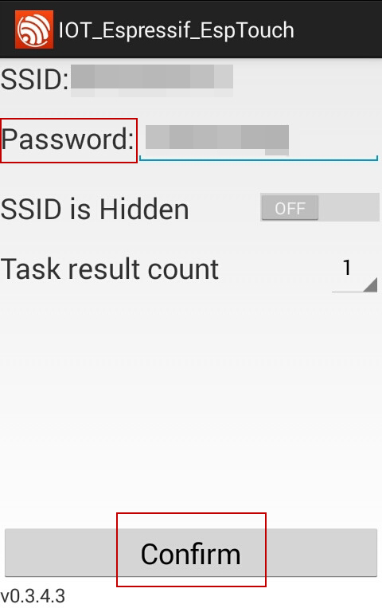
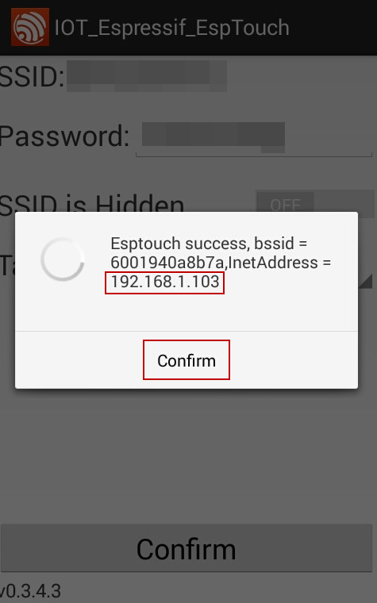

# Tổng quan
ESP Touch là protocol được dùng trong Smart Config để người dùng có thể kết nối tới các phiên bản modul ESP8266 thông qua cấu hình đơn giản trên Smartphone.
Ban đầu không thể kết nối với ESP8266, nhưng thông qua giao thức ESP-TOUCH thì Smartphone sẽ gửi gói UDP tới Access Point(AP) ở đây là ESP8266, mã hóa SSID và mật khẩu thành trường Length trong gói UDP, để ESP8266 có thể hiểu và giải mã được thông tin.

Cấu trúc gói tin sẽ có dạng

| 6  | 6  | 2      | 3   | 5    | Variable | 4   |
|----|----|--------|-----|------|----------|-----|
| DA | SA | Length | LLC | SNAP | DATA     | FCS |

Length bao gồm SSID và thông tin key cho ESP8266

# Chương trình

Tổ chức file căn cứ theo bài [Makefile cho các dự án phức tạp](../basic/complex-makefile.md), toàn bộ cấu trúc file, **Makefile, user_config.h, rf_init.c** giữ nguyên, thay đổi nội dung file `main.c` và thêm một số thư mục cần thiết. 

!!! note "Nội dung"
    Smartconfig cho ESP8266 thông qua Smartphone

## Lấy dự án về từ Github 

```bash
https://github.com/esp8266vn/esp8266-nonos-smart-config.git
cd sp8266-nonos-smart-config && make
make flash
```

## Sơ đồ file

```
├── assets
│   └── fota-flow.png
├── build
│   ├── driver
│   │   ├── key.o
│   │   ├── led.o
│   │   └── uart.o
│   ├── esp8266-nonos-app.a
│   ├── esp8266-nonos-app.out
│   └── user
│       ├── rfinit.o
│       ├── sc.o
│       ├── user_main.o
│       └── wps.o
├── driver
│   ├── key.c
│   ├── led.c
│   ├── Makefile
│   └── uart.c
├── firmware
│   ├── esp8266-nonos-app0x00000.bin
│   └── esp8266-nonos-app0x10000.bin
├── include
│   ├── driver
│   │   ├── key.h
│   │   ├── led.h
│   │   ├── uart.h
│   │   └── uart_register.h
│   └── user_config.h
├── ld
│   ├── eagle.rom.addr.v6.ld
│   ├── with-espboot-flash-at-0x2000-size-1M.ld
│   └── without-bootloader.ld
├── Makefile
├── README.md
├── SublimeAStyleFormatter.sublime-settings
└── user
    ├── Makefile
    ├── rfinit.c
    ├── sc.c
    ├── sc.h
    ├── user_main.c
    ├── wps.c
    └── wps.h

10 directories, 41 files

```

## Mã nguồn
Chương trình chính sẽ gọi phần cấu hình cho Smartconfig sau khi nút nhấn FLASH trên NodeMCU được nhấn thông qua hàm `sc_start` (nằm ở 2 file là `sc.c` và `sc.h`)

```
#include "osapi.h"
#include "user_interface.h"

#include "driver/key.h"
#include "driver/uart.h"
#include "driver/led.h"
#include "wps.h"
#include "sc.h"

#define KEY_NUM        1

#define KEY_IO_MUX     PERIPHS_IO_MUX_MTCK_U
#define KEY_IO_NUM     0
#define KEY_IO_FUNC    FUNC_GPIO0


LOCAL struct keys_param keys;
LOCAL struct single_key_param *single_key;

LOCAL void ICACHE_FLASH_ATTR
short_press(void)
{
  INFO("[KEY] Short press, run smartconfig\r\n");
  led_blink(1, 1);
  sc_start();
}

LOCAL void ICACHE_FLASH_ATTR
long_press(void)
{
  INFO("[KEY] Long press, run wps\r\n");
  led_blink(5, 5);
}


void ICACHE_FLASH_ATTR print_info()
{
  INFO("\r\n\r\n[INFO] BOOTUP...\r\n");
  INFO("[INFO] SDK: %s\r\n", system_get_sdk_version());
  INFO("[INFO] Chip ID: %08X\r\n", system_get_chip_id());
  INFO("[INFO] Memory info:\r\n");
  system_print_meminfo();

  INFO("[INFO] -------------------------------------------\n");
  INFO("[INFO] Build time: %s\n", BUID_TIME);
  INFO("[INFO] -------------------------------------------\n");

}


void ICACHE_FLASH_ATTR app_init()
{
  // const fota_info fota_conenction = {
  //   .host = "test.vidieukhien.net",
  //   .port = "80",
  //   .security = 0,
  //   .device_id = "device_id",
  //   .access_key = "access_key",
  //   .version = "version",
  //   .path = "/fota.json?dev={device_id|%X}&token={access_key|%s}&version={version:%s}"
  // };

  uart_init(BIT_RATE_115200, BIT_RATE_115200);

  print_info();

  single_key = key_init_single(KEY_IO_NUM, KEY_IO_MUX, KEY_IO_FUNC,
                                        long_press, short_press);

  keys.key_num = KEY_NUM;
  keys.single_key = &single_key;

  key_init(&keys);
  led_init();
  led_blink(10, 10); //1 second on, 1 second off

  wifi_set_opmode_current(STATION_MODE);

}

void ICACHE_FLASH_ATTR user_init(void)
{
  system_init_done_cb(app_init);

}

```

# Các hàm/ cấu trúc dùng trong SmartConfig

## Hàm smartconfig_start 
Hàm dùng để cấu hình thiết bị và kết nối nó tới AP

!!! note "Lưu ý"
    - Hàm chỉ được gọi trong mode Station
    - Gọi hàm `smartconfig_stop` để kết thúc quá trình SmartConfig trước khi gọi các hàm khác

Định nghĩa

```
bool smartconfig_start(sc_callback_t cb, uint8 log)
```

Thông số

Giá trị trả về

| TRUE  | Thành công |
|-------|------------|
| FALSE | Thất bại   |

## Hàm smartconfig_stop 
Hàm dùng để dừng quá trình Smart Config và giải phóng bộ nhớ được tạo ra bởi hàm  `smartconfig_start`

!!! note "Lưu ý"
    Sau khi kết nối được thiết lập thì người dùng có thể gọi hàm giải phóng bộ nhớ

Định nghĩa

```
bool smartconfig_set_type(sc_type type)
```

Thông số 
```
typedef enum {
 SC_TYPE_ESPTOUCH = 0,
 SC_TYPE_AIRKISS,
 SC_TYPE_ESPTOUCH_AIRKISS,
 } sc_type; 
```

Giá trị trả về

| TRUE  | Thành công |
|-------|------------|
| FALSE | Thất bại   |

## Hàm smartconfig_set_type
Hàm dùng để thiết lập kiểu protocol của `smartconfig_start`

!!! note "Lưu ý"
    Phải gọi hàm này trước hàm `smartconfig_start`

Định nghĩa

```
bool smartconfig_stop(void)
```

Thông số 
NULL

Giá trị trả về

| TRUE  | Thành công |
|-------|------------|
| FALSE | Thất bại   |

## Cấu trúc
Có 2 kiểu cấu trúc cho sc_status và sc_type

```
typedef enum {
SC_STATUS_WAIT = 0,
SC_STATUS_FIND_CHANNEL = 0,
SC_STATUS_GETTING_SSID_PSWD,
SC_STATUS_LINK,
SC_STATUS_LINK_OVER,
} sc_status; 
```

```
typedef enum {
SC_TYPE_ESPTOUCH = 0,
SC_TYPE_AIRKISS,
SC_TYPE_ESPTOUCH_AIRKISS,
} sc_type;
```

!!! note "Lưu ý"
    SC_STATUS_FIND_CHANNEL được dùng để hiển thị trạng thái khi tìm channel

# Phần mềm cho android và iOS
Có thể tải file apk dành cho android tại 
[ESP-Touch Android](https://espressif.com/sites/default/files/apks/esptouchandroid-apk_v0.3.4.3_0.rar)

Hoặc tải trực tiếp từ Playstore
[ESP8266 SmartConfig](https://play.google.com/store/apps/details?id=com.cmmakerclub.iot.esptouch&hl=vi)

Và file cho iOS
[ESP-Touch iOS](https://espressif.com/sites/default/files/apks/esptouchios-ipa_v0.3.4.3_0.rar)

# Hoạt động
- Kích hoạt chức năng Smart Config bằng cách lập trình và nạp firmware cho ESP
- Kết nối smartphone với router (kết nối smartphone với mạng wifi hiện có)
- Mở ESP-TOUCH App đã cài đặt trên smartphone
- Kiểm tra SSID (tương ứng với tên Wifi) và mật khẩu (ở đây là mật khẩu wifi của bạn) để kết nối tới thiết bị.
- Thực hiện ấn nút trong thời gian ngắn trên NodeMCU sau đó thả ra sẽ có thông báo

```
[INFO] BOOTUP...
[INFO] SDK: 2.0.0(656edbf)
[INFO] Chip ID: 000A8B7A
[INFO] Memory info:
data  : 0x3ffe8000 ~ 0x3ffe880c, len: 2060
rodata: 0x3ffe8810 ~ 0x3ffe9ff0, len: 6112
bss   : 0x3ffe9ff0 ~ 0x3fff0858, len: 26728
heap  : 0x3fff0858 ~ 0x3fffc000, len: 47016
[INFO] -------------------------------------------
[INFO] Build time: 2016-Th11-18_16:55:45_ICT
[INFO] -------------------------------------------
bcn 0
del if1
usl
mode : sta(60:01:94:0a:8b:7a)
add if0
```

- Mở phần mềm IOT_Espressift_EspTouch trên điện thoại đã kết nối wifi, nhập mật khẩu tại Password sau đó ấn confirm



- Tiếp tục ấn nút Flash trên NodeMCU sau đó ấn nút Confirm trên SmartPhone.



# Kết quả
- Nếu thành công sẽ có thông báo trên smartphone về địa chỉ IP của ESP8266 như sau
```
Esptouch success, bssid = xxxx, InnetAddress = 192.168.xx.xx
```
- Ngược lại sẽ có thông báo Esptouch fail.
- Kết quả logfile sẽ được ghi lại trên máy tính như sau

```
[INFO] BOOTUP...
[INFO] SDK: 2.0.0(656edbf)
[INFO] Chip ID: 000A8B7A
[INFO] Memory info:
data  : 0x3ffe8000 ~ 0x3ffe880c, len: 2060
rodata: 0x3ffe8810 ~ 0x3ffe9ff0, len: 6112
bss   : 0x3ffe9ff0 ~ 0x3fff0858, len: 26728
heap  : 0x3fff0858 ~ 0x3fffc000, len: 47016
[INFO] -------------------------------------------
[INFO] Build time: 2016-Th11-18_16:55:45_ICT
[INFO] -------------------------------------------
bcn 0
del if1
usl
mode : sta(60:01:94:0a:8b:7a)
add if0
[KEY] Short press, run smartconfig
SC version: V2.5.4
[SC] Started
scandone
scandone
[SC] SC_STATUS_FIND_CHANNEL
00:16:01:04:6d:d2: 599
00:16:01:04:6d:d2: 598
00:16:01:04:6d:d2: 597
00:16:01:04:6d:d2: 596
T|once 1 84
00:16:01:04:6d:d2: 599
00:16:01:04:6d:d2: 598
00:16:01:04:6d:d2: 597
00:16:01:04:6d:d2: 596
T|once 2 84
iBssid 00:16:01:04:6d:
buf 00:16:01:04:6d:
save, rssi:-81 00:16:01:04:6d:d2:
iCh lock
00:16:01:04:6d:d2: 598
00:16:01:04:6d:d2: 597
rigtt,rssi:-81 00:16:01:04:6d:d2:

TYPE: ESPTOUCH
T|sniffer on ch:2
T|AP MAC: 00 16 01 04 6d d2
T|Head Len : 84
[SC] SC_STATUS_GETTING_SSID_PSWD
[SC] SC_TYPE:SC_TYPE_ESPTOUCH
T|SYNC STATUS
xxxxx
T|pswd: mat_khau_wifi
T|ssid: ten_wifi
T|bssid: 00 16 01 04 6d d2 
[SC] SC_STATUS_LINK
scandone
xxxxx
connected with ten_wifi, channel 2
dhcp client start...
pm open,type:2 0
ip:192.168.1.xx,mask:255.255.255.0,gw:192.168.1.1
[SC] SC_STATUS_LINK_OVER
[SC] Phone ip: 192.168.1.xx
free heap:39984

```
