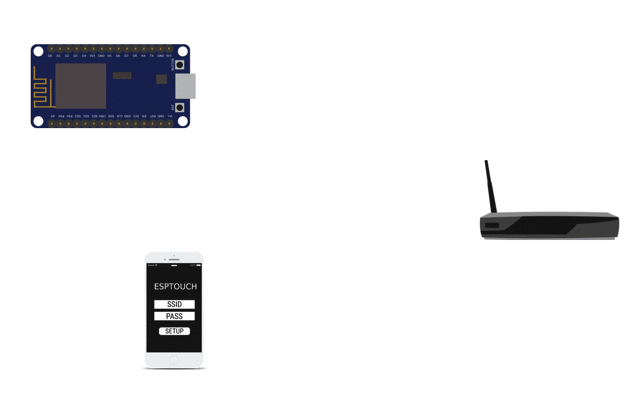

# ESP8266 Smart config

Smartconfig là một khái niệm được nhắc đến khi khi muốn cấu hình thông tin cho thiết bị WiFi kết nối nhanh chóng đến Internet nhất từ người dùng bằng chính thiết bị (điện thoại) của họ.

 

Để hiểu một cách đơn giản thì Smart config nghĩa là chúng ta gửi thông tin mạng wifi (bao gồm tên wifi và password wifi) cho ESP thông qua smartphone thay cho cách thông thường là phải khai báo thông tin này trong chương trình và nạp firmware xuống.
